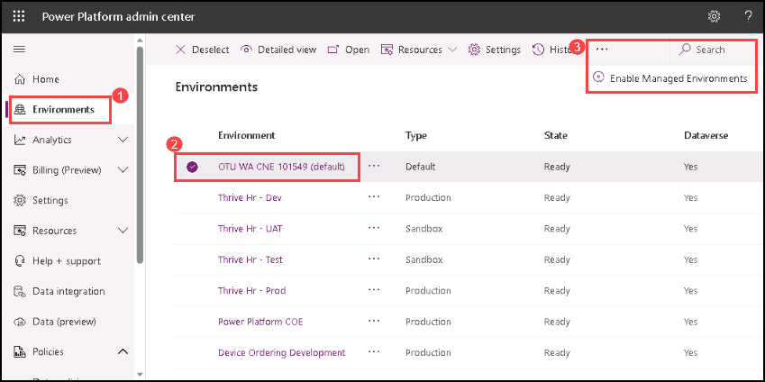
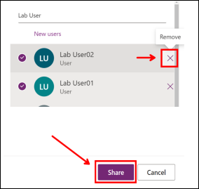

# Admin in a day

## M02-HOL-Application Lifecycle Management - Managed Environments and Pipeline

## Table of Contents

1. Exercise 1 - Managed Environment

   **Scenario**
   
   - Task 1: Upgrade defualt environment to managed environment

   - Task 2: Share the Canvas App to users

2. Exercise 2 – Power platform Pipelines

   **Scenario**
   
   - Task 1: 

   - Task 2: 

## Lab Test Environment

This hands-on lab is designed to be completed in an environment setup for multiple students to complete 
the Admin in a day series of hands-on labs.
You will be assigned one or more users to use to complete the hands-on tasks. Because this is a shared 
environment, some tasks that require a tenant Global Administrator or a Service Administrator will already 
be performed.
        

## Exercise 1: Managed Environments

### Scenario

In this exercise, you will be shifting a pre-made environment from an unmanaged state to a managed 
state. A managed environment can greatly expand the level of control for administrators. 

### Task 1: Upgrade defualt environment to managed environment

1. Go to the Power Platform admin center using your tenant administrator credentials (https://aka.ms/ppac).   
   
   a. Reminder: Your credentials are in the **"Environment Details"** tab.
   
      
    

2. Select **Environment (1)** tab from left panel and select the defualt environment named **OTU WA CNE <inject key="Deployment ID" enableCopy="false"/> (2)** and select the three dots to 
   view all the ribbon options, then select **Enable managed environment (3)** to start the configuration process for this environment. .

       

3. Administrators seeking to create or edit managed environments must have the Global Administrator role, Power Platform Administrator role, or the Dynamics 365 admin Azure Active            Directory role. Delegated admins, or Environment Admins will not be able to enable or edit managed environments. At the top of the panel that appears, the system informs you that a 
   particular license is required in order to use the resources. While an unmanaged environment will allow users to interact with resources freely, a managed environment prevents them 
   from doing so if they do not have the correct license for the respective areas. 

    a. In Limit Sharing, choose **Exclude sharing with security group**s. Once this is enabled, you can restrict the users the app gets shared to. You can exclude certain groups, or, as 
        you will next, limit the number of users the app can be shared to. 

    b. Select the **Limit individuals…** checkbox and set the limit number to **3**. 

    c. Set Solution Checker to **Warn**. This will validate any custom solutions being imported to the environment. 

    d. Leave the **Usage insights** checked. This item is selected by default. 

    e. For **Maker welcome content**, copy and paste the following into the text box: 

        
       ## Welcome to Contoso Power Apps 
       ### Let's get started with data 
       Before you start using Power Apps, please refer to our company guidance.
       1. **Get trained:** [Learning Videos]() and [training guides]() 
       2. **Contribute ideas:** Submit an idea for a new app or flow idea at [Suggestion box]() 
       3. **Learn from others:** [Top tips]() by expert makers at Contoso

      • This will be used to greet users when they log in or switch to the environment. This can either be written in plain text, or as Markdown, as seen above.

       

     f. Select **Enable** once completed

    

4. A green banner will appear at the top notifying you of the successful update..
  
    
  

### Task 2: Share the Canvas App to users

1. Go to the Power Apps Maker portal at https://make.powerapps.com.   
    
2. Make sure you are working in the default environment named **OTU WA CNE <inject key="Deployment ID" enableCopy="false"/>**.
   
   a. Your default environment is named differently from the one depicted in the screenshots.
   
      
    
3. Click on the **“Apps”** section of the left nav.

4. select the canvas app named **“DLP – Exercise 1 – Task 2” (1)** created previously and click on **share (2)**.

   
      
5. Search **Lab User01** and choose a user. 

   
     
6. Repeat this process two more times until you have three users to add and select **Share**.

   

7. A banner will appear at the top of the panel, which will show the sharing rules are enabled, and being enforced. This is because the owner is counted with the number of individuals the 
   app can be shared with.
   
          
     
8. Remove a user from the chosen users, then select **Share**.

   

9. Once complete, a banner should appear notifying you of the success. 

    

 **Congratulations!** You have completed this portion of the workshop.

