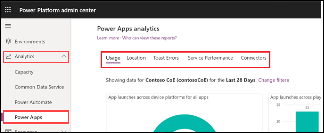
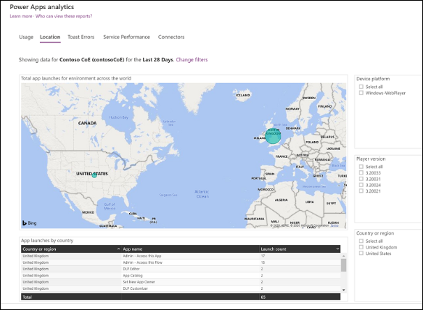
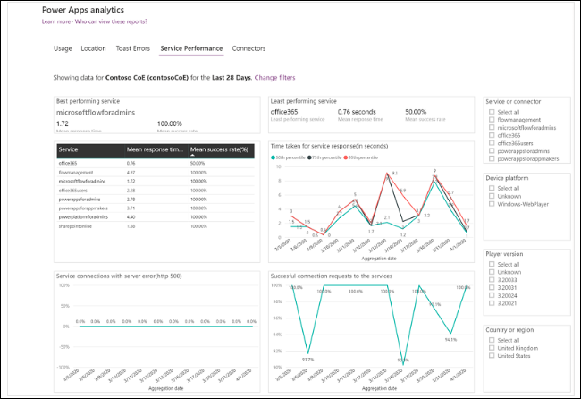
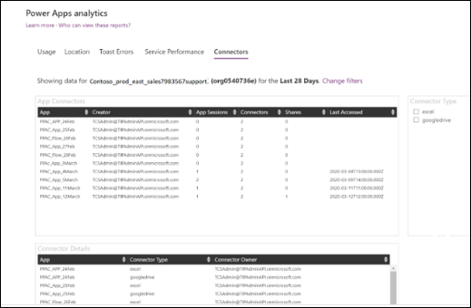
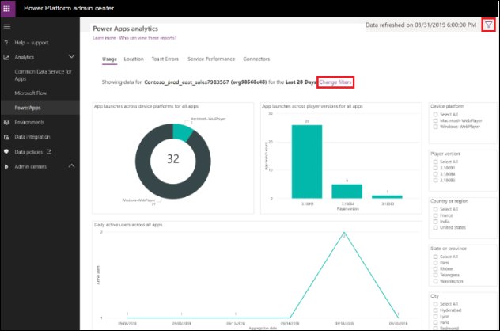
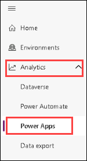
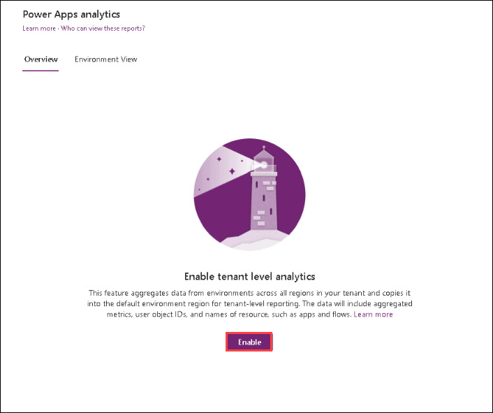
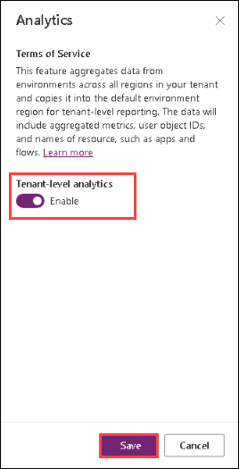
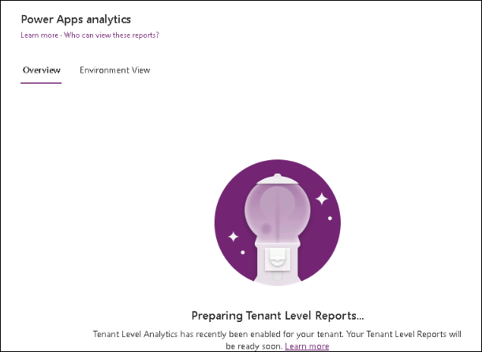

# Admin in a day

## M02-HOL- Monitor

## Table of Contents

1. Exercise 1 - Admin Analytics for Power Apps

   **Scenario**
   
   - Task 1: Explore the Power Apps analytics

2. Exercise 2 – Tenant-level analytics

   **Scenario**
   
   - Task 1: Enable tenant-level analytics

  
## Exercise 1: Admin Analytics for Power Apps

### Scenario

Analytics for the environment admin is available at the Microsoft Power Platform admin center. The admin reports provide a view into environment level usage, errors, service performance to drive governance, and change management services to users. These reports are available for canvas apps only and not available for model-driven apps

### Task 1: Explore the Power Apps analytics

1. Go to the Power Platform admin center using your tenant administrator credentials (https://aka.ms/ppac).   
   
   a. Reminder: Your credentials are in the **"Environment Details"** tab.
   
      

2. To access these reports, select **Analytics > Power Apps**. Reports appear in a menu bar at the top of the page.

   

3. **Usage** report is the default reports seen by the logged in environment admin. It provides total app launches and daily active users across all apps in the environment. Admins can  
     filter the view with attributes like device platform, player version, country/region, state, and city.

     

4. **Location** report provides a map-based view of usage. It gives an insight into regional adoption and usage trends.

    

5. **Toast Errors** report provides insights into the toast error trends, types, and counts per app to help drive improvements in app quality. The toast errors are errors displayed to the 
     end users of the app.

     

6. **Service Performance** report provides details of all standard and custom connectors to understand performance bottlenecks and client versus service API issues.

     

7. **Connectors report** provides visibility into the standard and custom connectors being used by canvas apps. The last 28 days of data are visible at the environment level.

     

8. You can also select **Change Filter** or the Filter button (Filter button.) in the upper-right corner of the page to change the environment.

    

9. Select the environment and time period from the drop-down lists, and then select **Apply** to save the changes. All the Power Apps analytics reports will now use this selection.

    

## Exercise 2: Tenant-level analytics

### Scenario

In this exercise, you will be enabling the tenant level analytics. 

### Task 1: Enable tenant-level analytics

1. Go to the Power Platform admin center using your tenant administrator credentials (https://aka.ms/ppac) if not opened already.   
   
   a. Reminder: Your credentials are in the **"Environment Details"** tab.
   
      
    
2. select **Analytics > Power Apps**

    

3. Select the Overview tab and select **Enable** to redirect to the Analytics pane.

   

4. In the Analytics pane, grant consent for tenant-level analytics by enabling the **Tenant-level analytics** feature and select **Save**

   

>**Note**: Once enabled, this feature aggregates data from environments across all regions in your tenant and copies it into the default environment region for tenant-level reporting. A tenant-level administrator role is required for one-time operation of granting consent for tenant-level analytics.

5. The Overview tab displays a message indicating that tenant-level analytics has been enabled. Typically, these reports are displayed within 24-48 hours of enabling the feature.

   

 
 **Congratulations!** You have completed this portion of the workshop.

