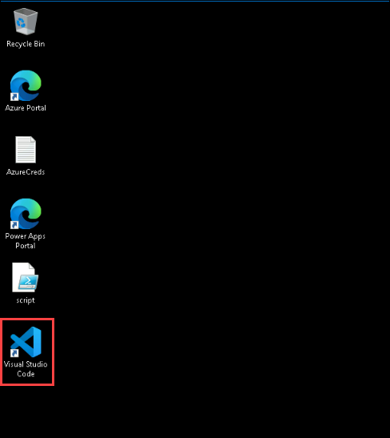
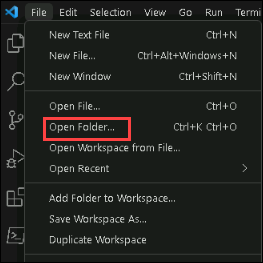
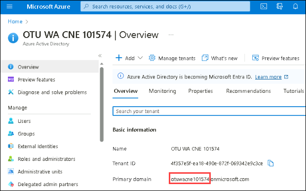
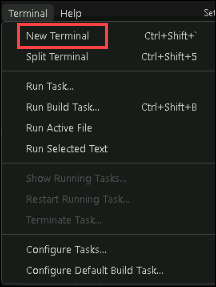

# Putting Governance in its Place

## M04-HOL- Empower

## Table of Contents

1. Exercise 1 - Create an internal Microsoft Power Platform hub

   **About**
   
   - Task 1: Get started with the Power Platform communication site template

## Exercise 1: Create an internal Microsoft Power Platform hub

### About

At the heart of growth is a community, a place for people to collaborate, share ideas, and discover new ways to apply technology to achieve more. A community is a safe place to ask 
questions to share tacit knowledge and expand skill sets. Organizations that have succeeded at creating a growing community of makers provide tools such as Yammer or Microsoft Teams 
groups, regular events and speaking opportunities, and foster an environment of ongoing learning.They make sure that every person in the organization can come together at regular 
intervals to socialize, share their knowledge, and explore new possibilities. Leaders who want to create a digital culture will put a framework in place for the community inside their 
organization to break down geographic and organizational silos.

### Task 1: Get started with the Power Platform communication site template

1. Open the **VSCode** by clicking on the icon in desktop shortcut.

    

2. Once the VSCode is opened, select **File** and click on **Open Folder**.

    

4. Now, navigate to this path `C:\LabFiles\PowerPlatformHub` and select the folder to open it in vscode.

    

   **Note:** PowerPlatformHub file download is done as part of pre-requisite.

6. Open the **Deploy-PowerPlatformHub.ps1** file from left navigation and make the below changes and save the file.

    a. Rename the **adminTenantName** with **TenantName**

    b. Rename the **companyName** with **TenantName**

    c. Rename the **ownerEmail** with **<inject key="AzureAdUserEmail"></inject>**

   **Note:** You can get the tenantname by navigating to Azure Portal, select the Azure Active Directory and copy the domain name like otuwacneID in overview tab. ID will be random for 
   each tenant.

     

8. Once You have updated the file, image should look like below.

    

9. Open the **Set-PowerPlatformHubAsDLPErrorSettings.ps1** file from left navigation and make the below changes and save the file.

     a. Rename the **newSiteURL** with **https://<TenantName>.sharepoint.com/sites/powerplatformhub/SitePages/Data-Loss-Prevention-(DLP)-Policies.aspx**

     b. Rename the **supportEmail** with **<inject key="AzureAdUserEmail"></inject>**

     c. Rename the **tenantId** with **<inject key="Tenant ID"></inject>**

   **Note:** Replace the TenantName with the value you copied earlier.

11.  Once You have updated the file, image should look like below.

     

12. Now, clcik on Terminal and select **New Terminal**
 
    

13. In the terminal window run the command **.\Deploy-PowerPlatformHub.ps1**, a new login window will pop-up, provide the login credentials and click on **Accept** to accept the 
    permissions and once the template deployment is finished you will get a **Success** message and **site url**.

     

    **Note**: Select **A** Yes to All if it asked for untrusted repository.

14. Navigate to the site url by selecting it and click on open to visit the site.

     

**Info:** For more details on Power Platform Hub click on the link https://learn.microsoft.com/en-us/power-platform/guidance/adoption/wiki-community

**Congratulations!** You have completed this portion of the workshop.

    
