# Admin in a day

## Dataverse for Teams

### Lab Scenario

 In this hands-on lab you will create a Power App in a team and see how
 to publish it to your team. You will also share with colleagues
 outside your team to see how broad distribution apps work.

### Lab Test Environment

 This hands-on lab is designed to be completed in an environment setup
 for multiple students to complete the Admin in a day series of hands
 on labs.

 You will be assigned one or more users to use to complete the tasks.
 Because this is a shared\
 environment, some tasks that require a tenant Global Administrator or
 a Service Administrator will already be completed. Your account will
 only be an environment administrator.

## Exercise 1: Create your first app

### Task 1: Add Power Apps and pin it

 In this task, you will add the Power Apps app, and then pin it to your
 pinned apps.

1. Click on the **... More added apps** button.

     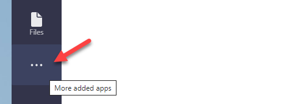

2. Search for power apps and select **Power Apps**.

     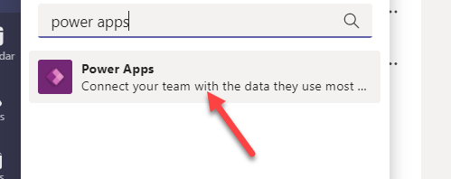

3. Click **Add**.                                            

4. Right click on the **Power Apps** app and select **Pin**. 

    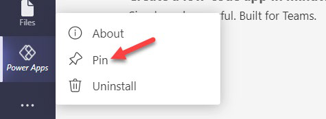
  

5. Do not navigate away from this page.

### Task 2: Create application and table

 In this task, you will create an application, a table, and add new
 columns to the table.

1. Navigate to Microsoft Teams and login.       

2. Click **Use the web instead**.               

3. Select **Power Apps**.                       

4. Select the **Home** tab and click Start now. 

 
    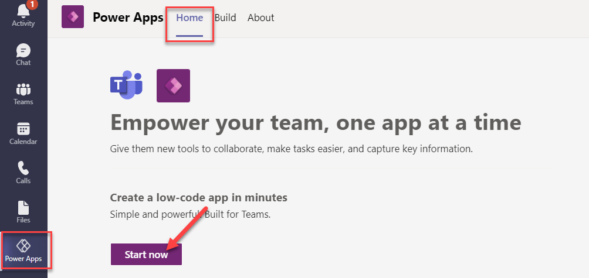
  

5. Select the **Central IT** team and click **Create**.

  
    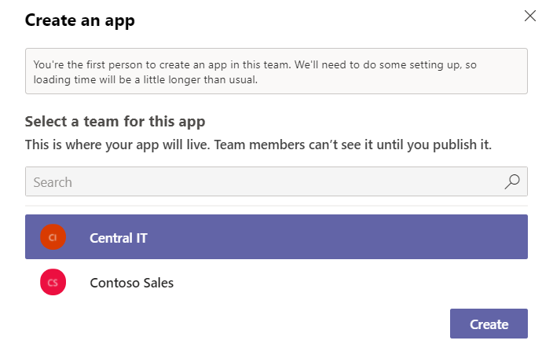
  

6. Enter **Special Request LA X** and click **Save**. Replace X with your lab user number.

  
    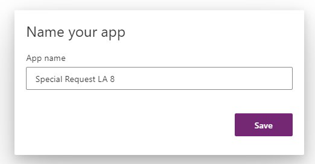
  

7. Select **With Data**.

  
     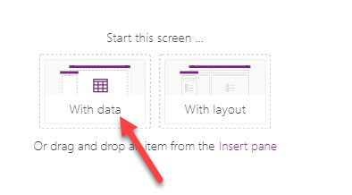
  

8. Click **+ Create new table**.

  
     
  

9. Enter **LA X Request** for Table name and click **Create**. Replace X with your lab user number.

  
     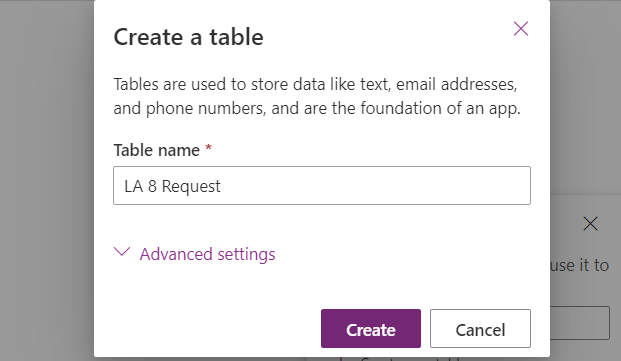
  

10. Click **+ Add column**.

  
     
  

11. Enter **Description** for Name, select **Text** for Type, and click to expand the **Advanced options** section.                                                           

  
    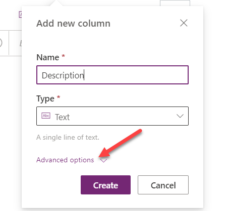
  

12. Change the **Max length** to **250** and click **Create**.

  
     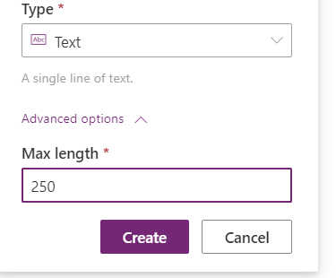
  

13. Click **+ Add column** again.                            

14. Enter **Requested date** for Name, select **Data** for Type, and click **Create**.                

     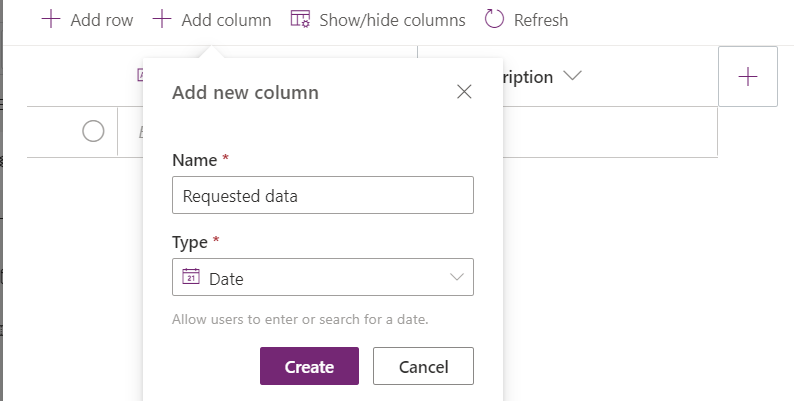
  

15. The table should now have three columns. Click on the **Name** cell and type **Ergonomic office chair**.

    
  

16. Enter **Description** and select today's date for **Requested date**.

  
     
  

17. Add few more request rows and click **Close**.

  
     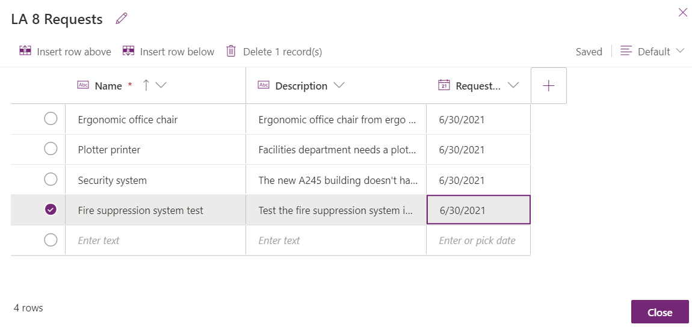
  

18. The app should now have a gallery and a form. Click **Save** and wait for the app to be saved.

  
      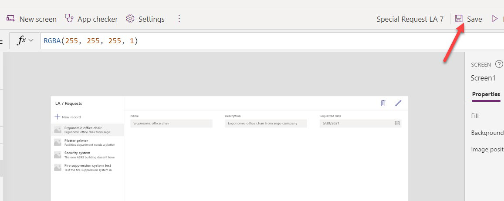
  

19. Click **Preview**.

     
  

20. The app should start in a preview. Click **+ New record**.

  
     
  

21. Provide a Name, Description, and a Requested data. 

22. Click **Save record**.                             

     
  

23. Close the preview.

  
     
  

24. Click **Publish to Teams**.

  
     
  

25. Click **Next**.                                          

26. Click **Add app as a tab**. This will make it discoverable on the channel.                             

  
     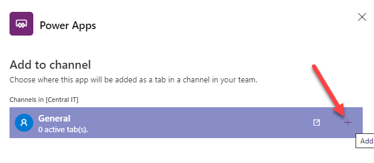
  

27. Click **Save and close**.                                

28. Select **Teams** and then select the **General** channel of the **Central IT** team.                        

     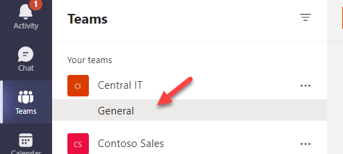
  

29. Locate the app tab you added and select it. The app should load.

  
     
  

30. Do not navigate away from this page.

## Exercise 2: Share your app

### Task 1: Share the app

 In this task, you will share the application and the table you
 created.

1. Select **Power Apps**.

  
     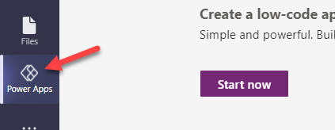
  

2. Select the **Build** tab, select the **Central IT** team, and click **See all**.

  
     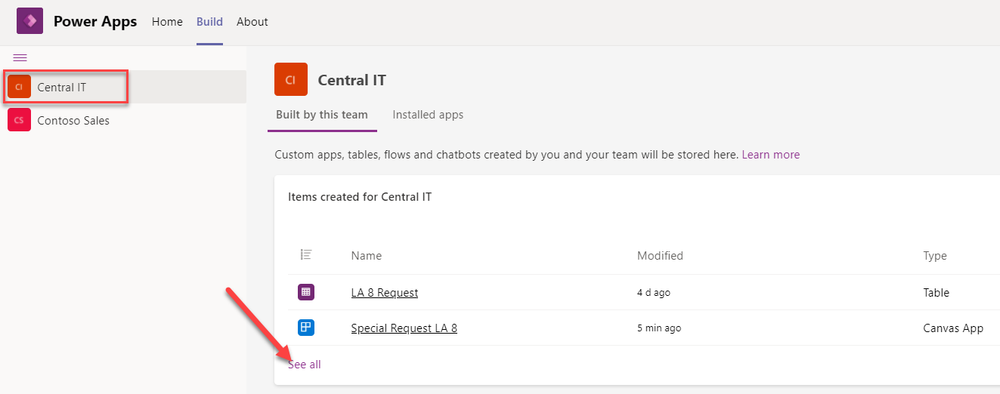
  

3. Select **Apps** and then click **Share with colleagues**. This can share the app outside the teams membership.                   
                                                                                                                 
  
  
  

4. Select **Lab Back Office**.

  
     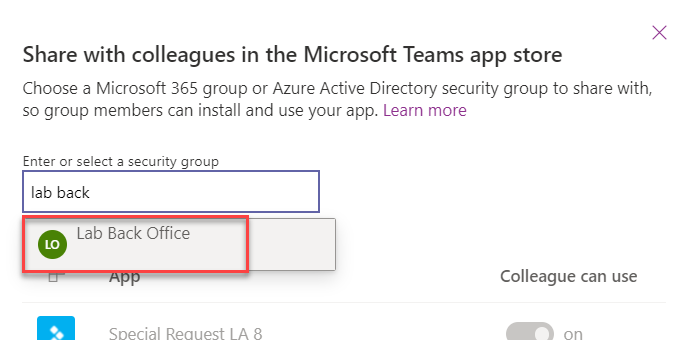
  

5. Make sure the **Lab Back Office** team members can use the app and then click **Save**.

  
      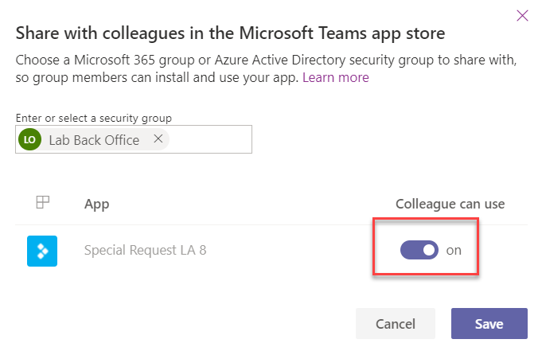
  

6. Select **Tables**, select the table you created and click **Manage permissions**.

  
     
  

7. Select the **Lab Back Office** team, give the team members the **Collaborate** permission, and click **Save**. You have now completed sharing with the group.  

  
     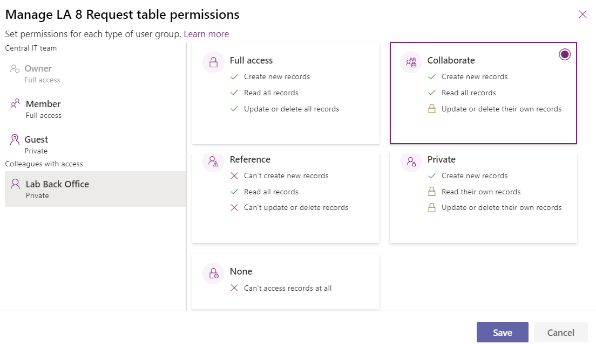
  

 ### DISCLAIMER

 This demo/lab contains only a portion of new features and enhancements
 in Microsoft Power Apps. Some of the features might change in future
 releases of the product. In this demo/lab, you will learn about some,
 but not all, new features.

